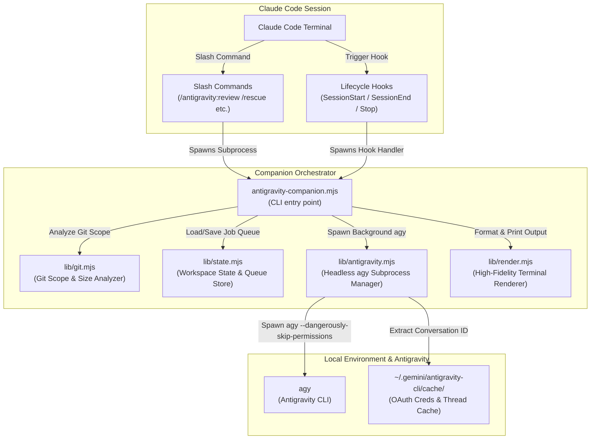
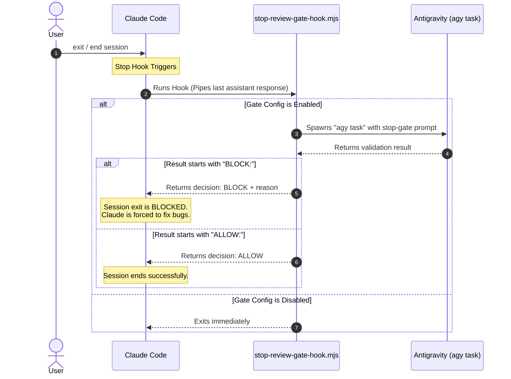

# Antigravity Plugin for Claude Code: Architecture & Codebase Walkthrough

This document provides a comprehensive structural review and technical explanation of the **Antigravity Claude Code Plugin (`antigravity-plugin-cc`)**.

The plugin serves as a bridge between **Claude Code** and the local **Antigravity CLI (`agy`)**, allowing developer sessions in Claude to delegating complex debugging tasks, initiate non-interactive code reviews, check job logs, or manage background-running tasks.

---

## 🗺️ Architectural Overview

The integration uses a lightweight, decoupled model where Claude Code executes markdown-defined slash commands and session-lifecycle hooks. These commands spawn an independent Node.js orchestrator (`antigravity-companion.mjs`) which executes git analysis, persists job queue state, invokes the local `agy` executable, and renders beautiful terminal dashboard reports.



---

## 📁 Project Directory Structure

```text
antigravity-plugin-cc/
├── package.json                   # Project scripts and engines (Node.js >= 18.18.0)
├── README.md                      # Setup guidelines and user usage manual
├── plugins/
│   └── antigravity/
│       ├── .claude-plugin         # Claude Code plugin registry configurations
│       ├── agents/
│       │   └── antigravity-rescue.md   # Subagent instructions for the "rescue" handoff
│       ├── commands/
│       │   ├── setup.md           # Setup verification (/antigravity:setup)
│       │   ├── review.md          # Standard review command (/antigravity:review)
│       │   ├── adversarial-review.md # Challenge-mode review (/antigravity:adversarial-review)
│       │   ├── rescue.md          # Task delegation command (/antigravity:rescue)
│       │   ├── status.md          # Queue status reporter (/antigravity:status)
│       │   ├── result.md          # Read stored job results (/antigravity:result)
│       │   └── cancel.md          # Background job canceller (/antigravity:cancel)
│       ├── hooks/
│       │   └── hooks.json         # Session hooks registry (SessionStart, SessionEnd, Stop)
│       ├── prompts/
│       │   ├── review.md          # Standard code review instruction template
│       │   ├── adversarial-review.md # Challenge review structured JSON contract
│       │   └── stop-review-gate.md   # Prompt template for stop-time review gate check
│       ├── scripts/
│       │   ├── antigravity-companion.mjs  # Orchestration CLI script (Main Entry)
│       │   ├── session-lifecycle-hook.mjs # Lifecycle reporter
│       │   ├── stop-review-gate-hook.mjs  # Session ending blocker gate
│       │   └── lib/
│       │       ├── antigravity.mjs   # Headless execution of agy CLI
│       │       ├── args.mjs          # Custom command line argument parser
│       │       ├── fs.mjs            # Robust text vs. binary filesystem utils
│       │       ├── git.mjs           # Advanced Git diff size & target analyzer
│       │       ├── job-control.mjs   # Job reference resolution & queue querying
│       │       ├── process.mjs       # Subprocess-tree lifecycle management
│       │       ├── prompts.mjs       # Template loader & value interpolator
│       │       ├── render.mjs        # Beautiful colored terminal dashboard generator
│       │       ├── state.mjs         # JSON state persistent container & pruning
│       │       ├── tracked-jobs.mjs  # Wrapped background task execution & log tracing
│       │       └── workspace.mjs     # Project workspace-root resolver
│       └── skills/
│           ├── antigravity-cli-runtime     # Skill governing rescue CLI execution contract
│           ├── antigravity-prompting       # Skill guiding prompt structure writing
│           └── antigravity-result-handling # Skill guiding task result presentation
└── tests/                         # Full Unit test coverage (utilizing native node --test)
```

---

## ⚙️ How It Works: Key Components & Flow

### 1. Markdown-Driven Extension Shell (`plugins/antigravity/commands/`)
Claude Code supports defining commands using a combination of **YAML Frontmatter** and **Markdown instruction prompts**. This approach allows Claude Code to pre-parse flags, query Git sizes, and ask the user whether they want foreground or background execution before calling the companion Node script.

For example, `review.md` includes:
```yaml
---
description: Run an Antigravity code review against local git state
argument-hint: '[--wait|--background] [--base <ref>] [--scope auto|working-tree|branch] [--focus <text>]'
disable-model-invocation: true
allowed-tools: Read, Glob, Grep, Bash(node:*), Bash(git:*), AskUserQuestion
---
```
When a user runs `/antigravity:review --base main`, Claude Code intercepts the slash command, matches the frontmatter, executes the markdown logic, and spawns:
```bash
node "${CLAUDE_PLUGIN_ROOT}/scripts/antigravity-companion.mjs" review "$ARGUMENTS"
```

---

### 2. Core Companion Orchestrator (`antigravity-companion.mjs`)
The orchestrator acts as the command dispatcher. It parses arguments using custom light-weight parsers (`lib/args.mjs`) and runs subcommands accordingly:

- **`setup`**: Checks for Node.js, `agy` presence, Google OAuth token expiry, and configures the optional hook review gate.
- **`review` / `adversarial-review`**: Runs uncommitted work or branch review.
- **`task`**: Submits a prompt to `agy` to resolve a bug or write code.
- **`status` / `result` / `cancel`**: Inspects, retrieves payloads from, or kills active background execution.

---

### 3. Smart Git Context Analyzer (`lib/git.mjs`)
To prevent blowing past model token limits or overloading the prompt context, the companion performs pre-flight git inspections:

1. **Detects Targets**: 
   - Uses `git rev-parse --show-toplevel` to ensure it's inside a git repository.
   - Detects the default branch (`main`, `master`, or `trunk`) and compares uncommitted changes or branch diffs (`git merge-base HEAD <base>`).
2. **Estimates Context Size**:
   - Gathers list of modified, staged, and untracked files (`git ls-files --others --exclude-standard`).
   - Counts file lists and measures combined diff size in bytes.
3. **Determines Input Mode**:
   - **`inline-diff`**: If the number of modified files and diff byte sizes are below configuration thresholds, the complete git status, unstaged diff, staged diff, and untracked text file contents are appended directly into the prompt.
   - **`self-collect`**: If the change is too large, it strips out the file contents, embeds a lightweight summary of modified files into the prompt, and supplies `collectionGuidance` instructing the Antigravity agent to run local read-only commands (e.g., `git diff`) directly to gather file contents inside its sandbox.

---

### 4. Non-Interactive Subprocess Executor (`lib/antigravity.mjs`)
The `agy` CLI is designed primarily for interactive terminal sessions. The plugin successfully automates it headlessly by spawning `agy` in a subprocess with specific arguments:

```javascript
const args = ["--dangerously-skip-permissions", "--print-timeout", "15m"];
if (conversationId) {
  args.push("--conversation", conversationId);
} else if (resumeLast) {
  args.push("--continue");
}
args.push("--print", prompt);

const proc = spawn("agy", args, {
  cwd: workspaceRoot,
  stdio: ["ignore", "pipe", "pipe"]
});
```

- **`--dangerously-skip-permissions`**: Bypasses interactive prompts requesting file read/write permission inside `agy`'s sandbox.
- **`--print`**: Instructs `agy` to execute the given prompt in a non-interactive mode, stdout-printing the final answer.
- **Thread Tracking**: When `agy` executes, it caches the active thread ID in `~/.gemini/antigravity-cli/cache/last_conversations.json`. The plugin parses this file upon process termination to identify the active thread ID, allowing subsequent `/antigravity:rescue --resume` commands to continue the exact same conversation.

---

### 5. Workspace-Contained State & Job Tracing (`lib/state.mjs` & `lib/tracked-jobs.mjs`)
The companion implements a complete task queue manager:

1. **State Isolation**:
   State directories are isolated per workspace. A unique hash is generated based on the canonical path of the workspace:
   ```javascript
   const slug = path.basename(workspaceRoot);
   const hash = createHash("sha256").update(canonicalWorkspaceRoot).digest("hex").slice(0, 16);
   const stateRoot = process.env.CLAUDE_PLUGIN_DATA ? ... : "/tmp/antigravity-companion";
   const stateDir = path.join(stateRoot, `${slug}-${hash}`);
   ```
2. **Queue Persistence (`state.json`)**:
   Tracks up to 50 historical or current background jobs (including starting times, elapsed durations, process IDs, thread IDs, status: `queued`, `running`, `completed`, `cancelled`, or `failed`).
3. **Payload Containment (`jobs/`)**:
   Individual job results and raw execution logs are saved in isolated JSON files (`jobId.json`) and logs (`jobId.log`) inside the state folder, keeping the user's primary code repository clean.
4. **Process Termination**:
   If a background job is cancelled, `lib/process.mjs` maps the active job process ID (PID) and terminates the entire process tree to cleanly abort all spawned threads.

---

### 6. Beautiful Dashboards & Rendering (`lib/render.mjs`)
Review subcommands render comprehensive terminal reports. For standard reviews, results are returned as structured markdown.
For adversarial reviews, the prompt mandates a strict JSON response. This JSON is parsed (including fallback filters to strip markdown code fences added by Gemini) and converted into a premium CLI Dashboard featuring:
- Highlighted verdict boxes (`approve` | `needs-attention` | `block`).
- Summaries of uncommitted design assumptions.
- Nested findings sorted dynamically by severity (`critical` first), referencing exact files, line numbers, and concrete actionable suggestions.

---

### 7. Optional Stop-Time Review Gate (`stop-review-gate-hook.mjs`)
The stop-time review gate is an advanced safeguarding mechanism that can be enabled via `/antigravity:setup --enable-review-gate`.



When enabled:
1. When Claude tries to exit or stop, Claude Code executes `stop-review-gate-hook.mjs`, passing the session details and the final response on stdin.
2. The hook compiles a prompt instructing Antigravity to review Claude's code changes.
3. The hook spawns `antigravity-companion.mjs task` synchronously to query `agy`.
4. If the review output starts with `BLOCK:`, the hook outputs:
   ```json
   { "decision": "block", "reason": "Antigravity stop-time review found issues: ..." }
   ```
   Claude Code intercepts this decision, blocks the session exit, and displays the reason. Claude must then write fresh fixes to resolve the issues before trying to exit again.
5. If the review outputs `ALLOW:`, the exit completes successfully.

---

## 🧪 Robust Error Resilience
The codebase is designed with defensive fault-tolerance in mind:
- **Piped Prompt Limits**: Prompts for `agy task` are piped through stdin rather than command arguments to bypass operating system command length limits (`ARG_MAX`) when forwarding extremely long Claude responses.
- **JSON Parsing Fallback**: When expecting structured JSON output (e.g., from `adversarial-review`), the parsing library evaluates raw text and dynamically searches for markdown code fences (e.g., ` ```json ... ``` `) to successfully extract the payload even if the model outputs wrapper text.
- **Process Cleanup**: Ensures orphan child-processes are terminated using process group signals (`process.kill(-pid)`) if parent runs are aborted.
